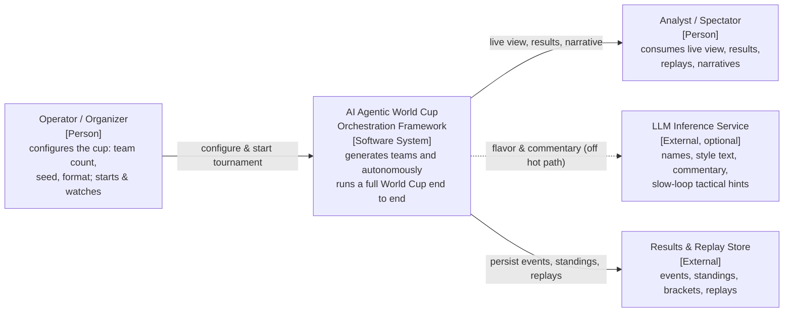
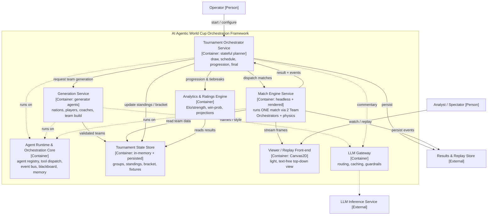
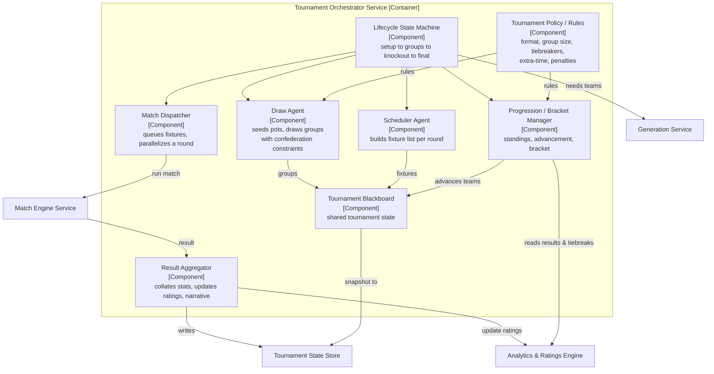
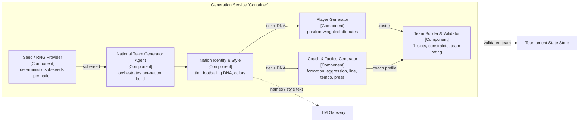
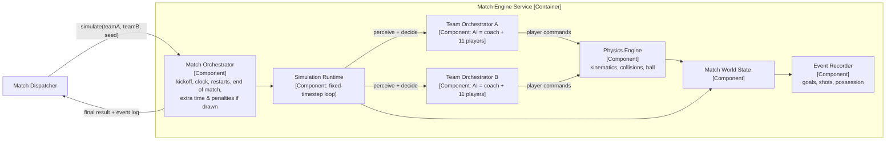
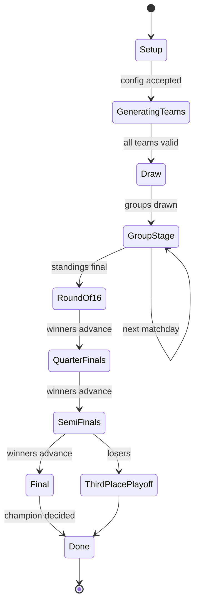
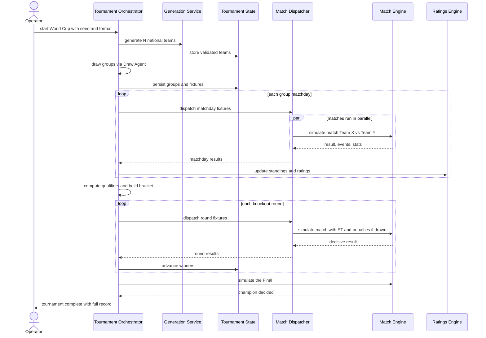
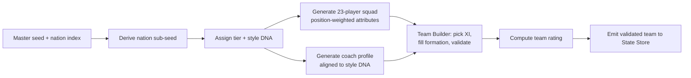
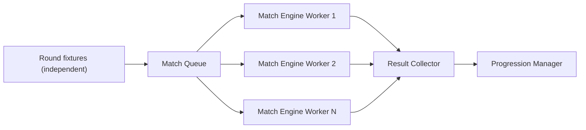
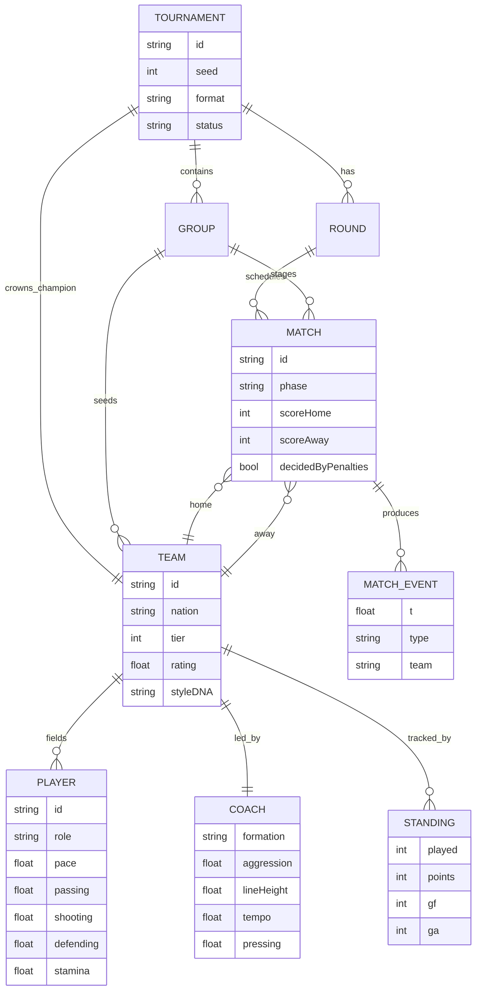

# AI Agentic World Cup Orchestration Framework — C4 Architecture

> A hierarchical multi-agent framework that **generates national teams**, **builds them**, and **autonomously runs an entire World Cup end-to-end** — from team generation and the group draw, through the group stage and knockout rounds, to the final and the crowning of a champion.
>
> This document uses the **C4 model** (Context → Container → Component → Dynamic) expressed in **standard Mermaid** (flowchart, state, sequence, ER). It builds directly on the match-level *one-AI-per-team orchestrator* designed previously — that design now becomes the **Match Engine Service** at the bottom of this hierarchy.

---

## 1. Goals & Non-Goals

**Goals**
- Generate `N` distinct national teams (rosters, coaches, tactical identities) deterministically from a seed.
- Run a complete tournament lifecycle without human intervention: draw → groups → knockouts → final.
- Reuse the existing physics-based match simulation as a headless, batch-runnable service.
- Be **agentic**: pluggable policy agents, a shared blackboard, an event bus, and a top-level conductor that plans and dispatches.
- Be **reproducible**: the same seed always yields the same tournament.

**Non-Goals**
- Putting an LLM inside the per-tick physics loop (latency + non-determinism). LLMs stay strictly **off the hot path**.
- Real player/nation licensing or real-world data. Everything is generated.
- Real-time multiplayer or betting features.

---

## 2. Design Principles

1. **Hierarchical orchestration.** Three orchestration scales: *Tournament* (whole cup) → *Match* (one game) → *Team* (11 players + coach). Each higher level treats the lower level as a tool/service.
2. **Deterministic core, optional creative edge.** A seeded RNG drives all generation and simulation. LLMs only add *flavor* (names, style narratives, commentary) and *slow-loop tactical hints* — always cacheable by seed.
3. **Agents own decisions; engines own mechanics.** Agents decide *what* (draw, dispatch, allocate roles, advance teams). Deterministic engines compute *how* (physics, standings math, Elo).
4. **Stateless agents over a shared blackboard.** Agents read/write a versioned tournament state; nothing critical lives only in an agent's head, enabling replay and parallelism.
5. **Parallelize the independent.** Matches within the same round are independent and run concurrently across Match Engine workers.

---

## 3. C4 Level 1 — System Context



The framework is a single deployable system. Humans only configure and observe. The two external dependencies are optional (LLM) or supporting (persistence) — the core can run fully self-contained and deterministic without either.

---

## 4. C4 Level 2 — Containers



### Container responsibilities

| Container | Responsibility | Notes |
|---|---|---|
| **Agent Runtime & Orchestration Core** | The agentic substrate: registers agents, dispatches their tools, routes events, hosts the shared blackboard and memory. | This is the "framework." Maps well to a LangGraph-style state graph + a worker pool. |
| **Tournament Orchestrator** | Top-level conductor. A state machine over the cup lifecycle; owns draw, scheduling, progression, bracket, and the final. | Stateful but persists everything to the State Store for replay. |
| **Generation Service** | Hosts the generator agents that produce nations, players, coaches, and assembled teams. | Fully deterministic from sub-seeds. |
| **Match Engine Service** | Runs a single match end-to-end (the prior design), headless for batch or rendered for viewing. | Idempotent: `(teamA, teamB, seed) → result`. |
| **Analytics & Ratings Engine** | Elo/strength ratings, win probabilities, standings math, tiebreakers, projections. | Pure functions over state. |
| **Tournament State Store** | Authoritative tournament state: groups, fixtures, standings, bracket, results. | In-memory hot copy + persisted snapshots. |
| **Viewer / Replay Front-end** | Renders live matches or replays from recorded events. | The light, text-free Canvas2D view. |
| **LLM Gateway** | Single choke point for any LLM call: prompt templating, caching (keyed by seed), guardrails. | Keeps non-determinism contained and auditable. |

---

## 5. C4 Level 3 — Components

### 5.1 Tournament Orchestrator Service



### 5.2 Generation Service



The **Nation Identity & Style** component assigns a *tier* (which scales attribute means) and a *style DNA* (e.g., possession, high-press, counter, direct) that biases both the player attribute distribution and the coach profile — so generated teams play recognizably differently.

### 5.3 Match Engine Service (reuses the prior one-AI-per-team design)



Each **Team Orchestrator** is the three-layer agent from the previous design (slow Coach loop + fast Role-Allocator loop + per-player behaviour resolver, behind a pluggable decision policy). The Match Engine simply runs two of them against each other and reports the result — turning a *real-time, rendered* simulation into a *batch, headless* function the tournament can call 64 times.

---

## 6. Agent Catalog

| Agent | Phase | Trigger / Loop | Key tools | Output |
|---|---|---|---|---|
| **Tournament Orchestrator** | Run | Tournament lifecycle FSM | Draw, Scheduler, Dispatcher, Progression | Champion + full record |
| **Draw Agent** | Run | Once, after generation | Seed, Policy (pot/confederation rules) | Groups |
| **Scheduler Agent** | Run | Per round | Policy (round-robin / bracket) | Fixtures |
| **Match Dispatcher** | Run | Per round | Worker pool, Match Engine | Parallel match results |
| **Progression / Bracket Manager** | Run | After each round | Ratings (standings, tiebreakers) | Advancing teams, bracket |
| **Result Aggregator** | Run | Per match | Ratings, LLM Gateway (narrative) | Stats, updated ratings |
| **National Team Generator** | Build | Per nation | Seed, Identity, Player/Coach gen, Builder | One validated team |
| **Player Generator** | Build | Per player slot | Seed, attribute model | Player with attributes |
| **Coach & Tactics Generator** | Build | Per team | Seed, style DNA | Coach profile |
| **Team Builder & Validator** | Build | Per team | Formation rules, rating function | Match-ready team |
| **Team Orchestrator (×2 / match)** | Match | Per tick (fast) + per few sec (slow) | Decision Policy, blackboard | Player commands |
| **Commentary Agent** *(optional)* | Run | Per key event | LLM Gateway | Narrative text |

---

## 7. Tool Catalog

| Tool | Used by | Purpose | Deterministic |
|---|---|---|---|
| **Seeded RNG** | All generators, sim | Reproducible randomness from sub-seeds | Yes |
| **Attribute Model** | Player Generator | Map (position, tier, DNA) → attributes | Yes |
| **Match Engine `simulate()`** | Dispatcher | Run one match → result + events | Yes (per seed) |
| **Standings Calculator** | Progression | Points, GD, head-to-head tiebreaks | Yes |
| **Elo / Rating Updater** | Aggregator | Update strength after each match | Yes |
| **Bracket Builder** | Progression | Map qualifiers → knockout slots | Yes |
| **LLM Gateway call** | Generation, Commentary | Names, style, commentary, tactical hints | No (cached by seed) |

---

## 8. Dynamic Views

### 8.1 Tournament Lifecycle (state machine)



> Knockout matches resolve via a sub-procedure: regulation → extra time if drawn → penalty shootout if still drawn. The Match Orchestrator owns this so the tournament always receives a decisive result.

### 8.2 End-to-End Orchestration (sequence)



### 8.3 Generation Flow (per nation)



### 8.4 Round Parallelism



---

## 9. Data Model



---

## 10. Orchestration, State & Memory

- **Blackboard pattern.** The Tournament Blackboard holds the single source of truth during a run; agents are stateless functions over it. The blackboard is snapshotted to the State Store after every round, so a run can be paused, resumed, or replayed.
- **Event bus.** Matches emit events (goal, full-time, qualifier-decided). The orchestrator subscribes and reacts (update standings, advance bracket) rather than polling.
- **Memory tiers.** *Short-term* = current match world state (discarded after the match, except the event log). *Long-term* = tournament state, ratings history, generated rosters (persisted).
- **Idempotency.** `simulate(teamA, teamB, seed)` and every generator are pure given their seed, so re-running a failed step is safe and produces identical output.

---

## 11. Determinism & Reproducibility

A single **master seed** deterministically derives all sub-seeds:

```
master_seed
 ├─ nation_seed[i]      = hash(master_seed, "nation", i)
 ├─ draw_seed           = hash(master_seed, "draw")
 └─ match_seed[m]       = hash(master_seed, "match", round, fixtureId)
```

Given the same master seed and config, the framework reproduces the **identical tournament** — same teams, same draw, same scorelines, same champion. LLM outputs (names, commentary) are cached by their seed-derived key so even the "creative" layer is reproducible across runs.

---

## 12. Scale & Performance

- A 32-team cup = **48 group matches + 16 knockout matches = 64 matches**. Each headless match runs far faster than real time, and group/round matches are independent → run them on a **worker pool** (Node worker threads, web workers, or serverless fan-out).
- The expensive part is *never* an LLM in the loop — it is bounded physics over ~22 bodies per match. End-to-end a full cup completes in seconds to low minutes headless.
- The Viewer only renders matches the operator chooses to watch; the rest run headless and are replayable from their event logs on demand.

---

## 13. Suggested Technology Mapping

| Concern | Suggested implementation |
|---|---|
| Orchestration core / FSM | LangGraph-style state graph, or a durable workflow engine for pause/resume |
| Agent runtime & tool dispatch | Lightweight in-process registry; tools as typed functions |
| Match Engine | The existing single-file canvas sim, refactored to run **headless in Node** (no DOM) for batch and **in-browser** for rendering — one codebase, two entry points |
| State store | In-memory hot copy + JSON/SQLite snapshots (Postgres if multi-run history is needed) |
| Parallel execution | Worker pool / web workers / serverless fan-out keyed by `match_seed` |
| LLM Gateway | A single client (e.g., Claude API) with prompt templates, seed-keyed cache, and output guardrails |
| Front-end | Reuse the light, text-free Canvas2D viewer; feed it either live frames or a recorded event log |

---

## 14. Honest Assessment & Risks

- **"Agentic" here means hierarchical orchestration + pluggable policy agents — not an LLM calling tools in a loop to run physics.** If you only ever want one fixed ruleset, a plain workflow engine would do the same job with less ceremony. The agentic framing earns its keep when you want: swappable decision policies (heuristic vs RL), per-nation asymmetric tactics, narrative generation, and easy extension to new tournament formats.
- **Keep the LLM off the hot path.** Per-tick decisions must stay heuristic/RL for determinism and speed. Any LLM use belongs in generation flavor, commentary, or the Coach's slow loop — always cached.
- **Tiebreakers and edge cases are where tournaments get messy** (three-way ties on points, fair-play tiebreaks, drawn knockouts). Encode them explicitly in **Tournament Policy** and unit-test them, rather than letting an agent improvise.
- **Determinism is a feature, protect it.** Any nondeterministic source (unordered parallelism writing shared state, `Math.random`, unseeded LLM calls) will silently break reproducibility. Funnel all randomness through the Seed Provider and all LLM calls through the Gateway.

---

## 15. Incremental Build Roadmap

1. **Headless Match Engine** — refactor the simulation to run without a DOM and return `{ result, events }`.
2. **Generation Service** — deterministic nation/player/coach/team generation with tiers and style DNA.
3. **Tournament Orchestrator** — lifecycle FSM: draw → group standings → bracket → final.
4. **Analytics & Ratings** — Elo, standings math, tiebreakers, projections.
5. **Persistence & replay** — snapshot state, record/replay event logs.
6. **Parallel execution** — worker pool for concurrent matches per round.
7. **Viewer integration** — watch any match live or replay from its log.
8. **Optional LLM layer** — names, commentary, tactical hints via the Gateway.
