# AI Agentic World Cup Orchestration Framework — Comprehensive Architecture

**Status:** Draft v1 · **Style:** arc42 + C4 · **Diagrams:** standard Mermaid (no `C4` syntax)

This is the master architecture document for the framework that **generates national teams**, **builds them**, and **autonomously runs a full World Cup end-to-end** (generation → draw → group stage → knockouts → final → champion). It subsumes the earlier C4 summary and adds interface contracts, a code-level view, runtime scenarios, deployment topologies, cross-cutting concepts, architecture decisions, quality scenarios, and a risk register.

The match-level *one-AI-per-team orchestrator* designed earlier is reused here as the **Match Engine** at the bottom of the orchestration hierarchy.

---

## 1. Introduction & Goals

### 1.1 What the system does
A single deployable system in which AI agents, arranged in a **three-level orchestration hierarchy** (Tournament → Match → Team), conduct an entire World Cup with no human intervention beyond configuration. Everything — teams, players, coaches, draw, scorelines, champion — is **generated deterministically from one master seed**.

### 1.2 Top quality goals

| # | Quality goal | Why it dominates |
|---|---|---|
| Q1 | **Reproducibility** | Same seed + config ⇒ byte-identical tournament. Enables testing, debugging, sharing, and trust. |
| Q2 | **Performance / throughput** | A full 64-match cup completes headless in seconds–minutes; matches run faster than real time. |
| Q3 | **Modifiability** | New tournament formats, decision policies (heuristic ↔ RL), and rules added without touching the core. |
| Q4 | **Reliability / resumability** | A crash mid-round resumes from the last snapshot with identical results. |
| Q5 | **Observability** | Every run is traceable and verifiable via a deterministic run hash. |

### 1.3 Stakeholders

| Stakeholder | Concern |
|---|---|
| Operator / Organizer | Configure and start a cup; trust the result is fair and reproducible. |
| Analyst / Spectator | Watch live or replay any match; consume standings, brackets, narratives. |
| Engineer | Extend formats/policies; debug a specific match by seed; keep determinism intact. |
| Platform owner | Run cups cheaply and at scale; observe health and cost. |

---

## 2. Constraints

| Constraint | Implication |
|---|---|
| Match physics must be **deterministic & fast** | No LLM, no wall-clock, no unseeded RNG inside the per-tick loop. |
| Reuse the existing canvas simulation | One Match Engine codebase, two entry points (headless Node + browser render). |
| LLM is **optional and off the hot path** | LLM only for names/style/commentary/slow-loop hints, always cached by seed. |
| Single-binary dev experience required | Must run end-to-end in one process before scaling out. |
| Light, text-free rendering (from prior design) | Viewer constraints carry over unchanged. |

---

## 3. Context & Scope

### 3.1 Business context

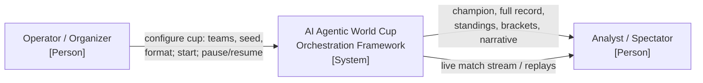

### 3.2 Technical context

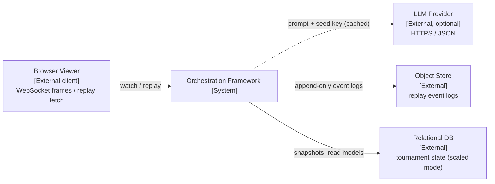

### 3.3 In / out of scope

**In:** generation, draw, scheduling, group & knockout play, ET/penalties, standings & tiebreakers, ratings, replay, parallel execution, persistence, observability.
**Out:** real licensing/data, betting, real-time human play, transfer/season modes.

---

## 4. Solution Strategy

| Driver | Strategic decision |
|---|---|
| Q1 Reproducibility | One master seed → hashed sub-seed tree; all randomness and LLM calls keyed by seed. |
| Q1/Q4 | **Event sourcing**: matches and tournament emit append-only events; state is a projection → free replay & resume. |
| Q2 Performance | Headless Match Engine; **worker-pool parallelism** for independent matches in a round. |
| Q3 Modifiability | **Hierarchical FSM orchestration** + **Strategy pattern** for decision policy + config-driven formats. |
| Q3 | Agentic substrate: stateless agents over a shared **blackboard**, dispatched by an **agent runtime**. |
| Q5 Observability | Structured domain events → metrics/traces/logs + a per-run determinism hash. |

---

## 5. Building Block View (C4)

### 5.1 Level 1 — System Context

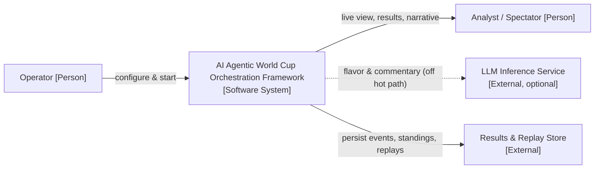

### 5.2 Level 2 — Containers

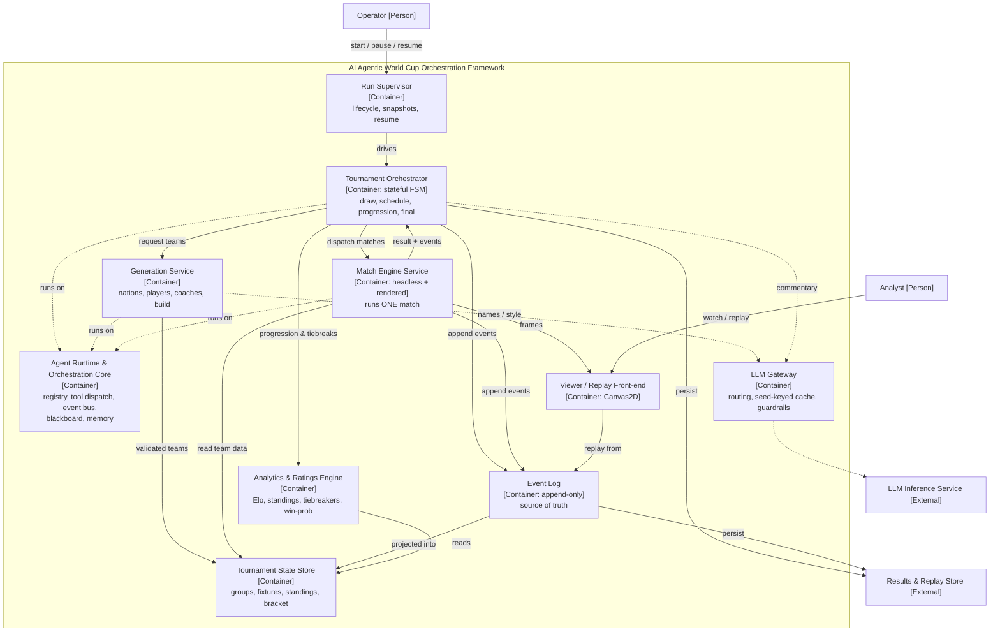

### 5.3 Level 3 — Components

**Tournament Orchestrator**

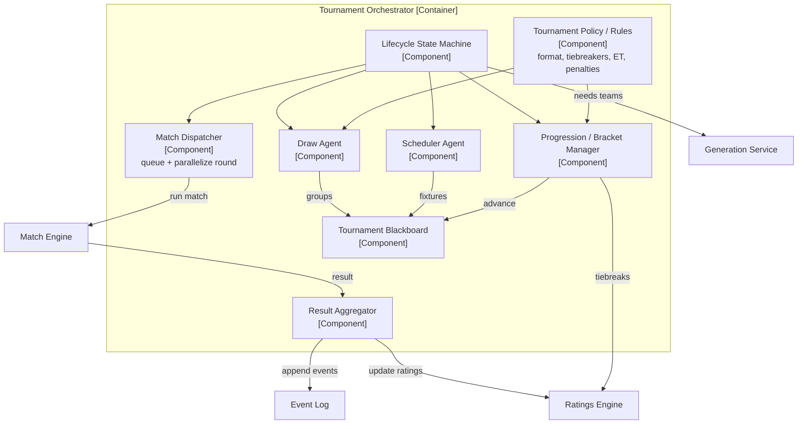

**Generation Service**

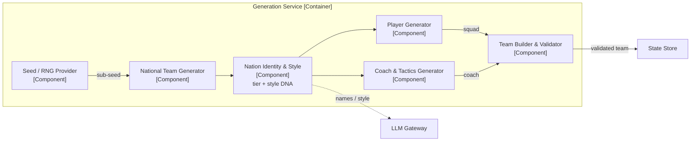

**Match Engine** (reuses the prior one-AI-per-team design)

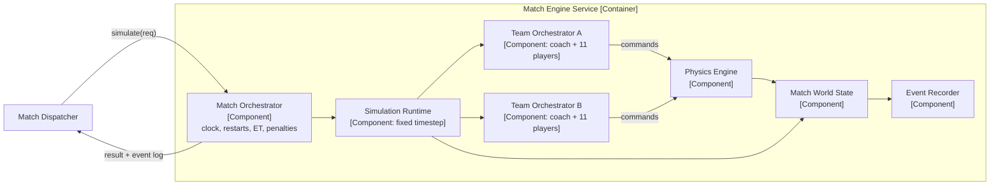

### 5.4 Level 4 — Code (key abstractions)

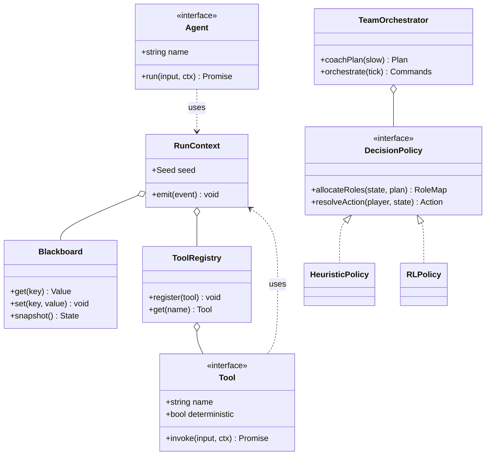

---

## 6. Interface & Schema Contracts

These are the load-bearing contracts (TypeScript-style for precision; language-agnostic in intent).

```ts
// ---------- Determinism ----------
type Seed = number;                                   // 32-bit master seed
function subSeed(master: Seed, ...path: (string|number)[]): Seed; // pure hash

// ---------- Domain ----------
type Role = "GK" | "DEF" | "MID" | "FWD";
type StyleDNA = "possession" | "high_press" | "counter" | "direct" | "balanced";
type Formation = "4-3-3" | "4-4-2" | "3-5-2" | "4-2-3-1";

interface Player {
  id: string; role: Role;
  pace: number; accel: number; shooting: number; passing: number;
  dribbling: number; vision: number; defending: number; stamina: number;
  teamwork: number; mass: number;                     // 0..1 except mass (kg-ish)
}
interface CoachProfile {
  formation: Formation;
  aggression: number; lineHeight: number; tempo: number;
  pressing: number; directness: number;               // all 0..1
}
interface Team {
  id: string; nation: string; tier: 1|2|3|4; styleDNA: StyleDNA;
  rating: number;                                     // derived team strength
  squad: Player[]; xi: string[]; coach: CoachProfile;
  colors: { primary: string; secondary: string };
}

// ---------- Match Engine (the reused simulation) ----------
interface MatchRules { duration: number; extraTime: boolean; penalties: boolean; }
interface MatchRequest {
  matchId: string; home: Team; away: Team; seed: Seed;
  rules: MatchRules; render?: boolean;                // headless when false
}
type MatchEventType =
  "kickoff" | "goal" | "shot" | "save" | "out" |
  "fulltime" | "et_start" | "penalty" | "end";
interface MatchEvent { t: number; type: MatchEventType; team?: "home"|"away"; meta?: object; }
interface MatchStats { possHome: number; shotsHome: number; shotsAway: number; }
interface MatchResult {
  matchId: string; scoreHome: number; scoreAway: number;
  decidedBy: "regulation" | "extra_time" | "penalties";
  winner: "home" | "away" | null;
  events: MatchEvent[]; stats: MatchStats;
}
interface MatchEngine { simulate(req: MatchRequest): Promise<MatchResult>; }

// ---------- Agent / Tool framework ----------
interface RunContext { seed: Seed; blackboard: Blackboard; tools: ToolRegistry; emit(e: DomainEvent): void; }
interface Tool<I, O>  { name: string; deterministic: boolean; invoke(i: I, ctx: RunContext): Promise<O> | O; }
interface Agent<I, O> { name: string; run(i: I, ctx: RunContext): Promise<O>; }

// ---------- Tournament ----------
type Phase = "setup"|"generating"|"draw"|"group"|"r16"|"qf"|"sf"|"final"|"done";
interface TournamentConfig {
  format: "world_cup_32" | "world_cup_48" | "custom";
  teams: number; groups: number; perGroup: number; advancePerGroup: number;
  thirdPlacePlayoff: boolean; seed: Seed;
}
interface Fixture { id: string; phase: Phase; homeId: string; awayId: string; }
interface Standing { teamId: string; played: number; w: number; d: number; l: number; gf: number; ga: number; pts: number; }
interface DomainEvent { seq: number; t: string; type: string; payload: object; }
```

### 6.1 Tiebreaker order (Tournament Policy)
Applied in order until the tie breaks: **points → goal difference → goals for → head-to-head points → head-to-head GD → fair-play → seeded drawing of lots** (the last is deterministic via `subSeed(master,"tiebreak",groupId)`).

### 6.2 Rating update (Ratings Engine)
Elo with expected score `E = 1 / (1 + 10^((Rb − Ra)/400))`, update `Ra' = Ra + K·(S − E)`, `K` scaled by stage (group `K=20`, knockout `K=30`), optional margin-of-victory multiplier `ln(|gd|+1)`.

---

## 7. Runtime View (Scenarios)

### 7.1 Team generation (per nation)

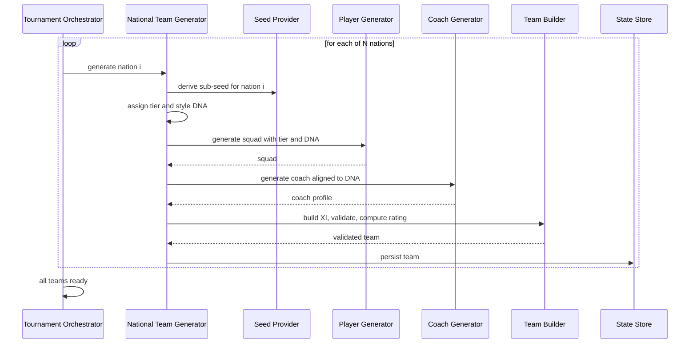

### 7.2 Group matchday (parallel)

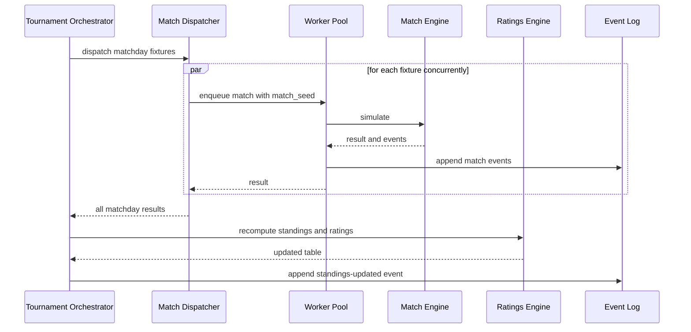

### 7.3 Knockout match resolution

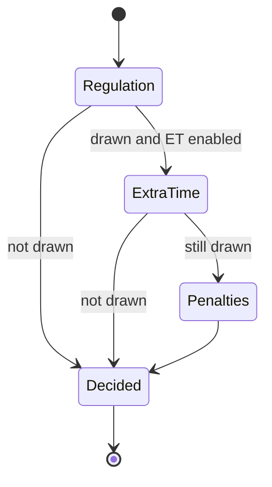

### 7.4 Failure & idempotent retry

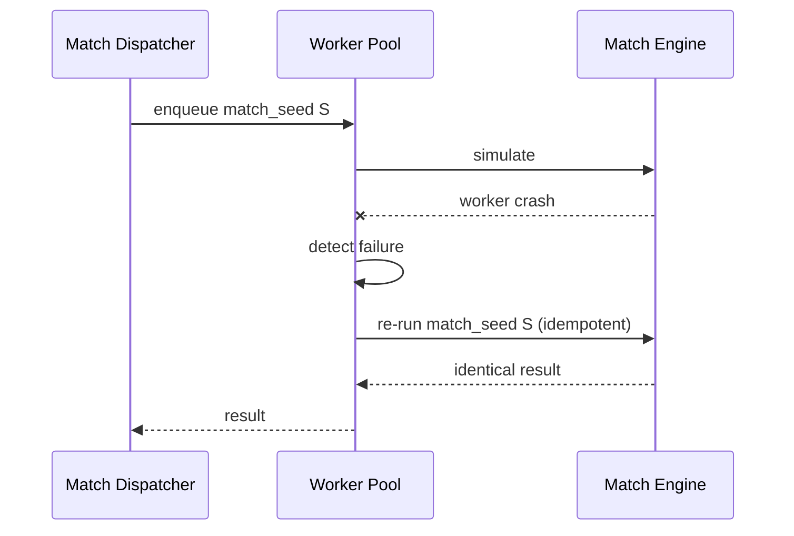

### 7.5 Replay from event log

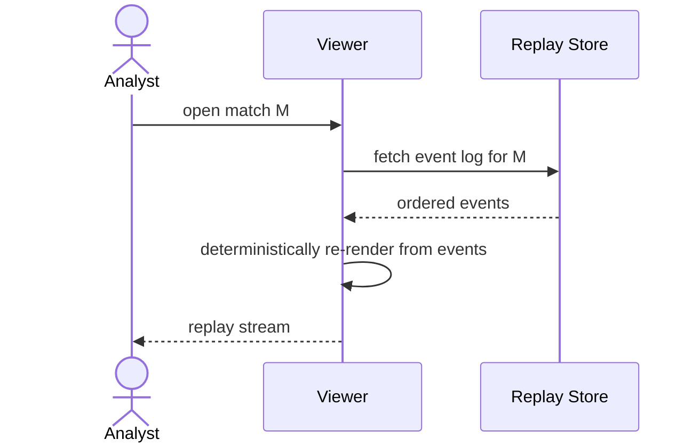

---

## 8. Deployment View

### 8.1 Topology A — single process (dev / small runs)

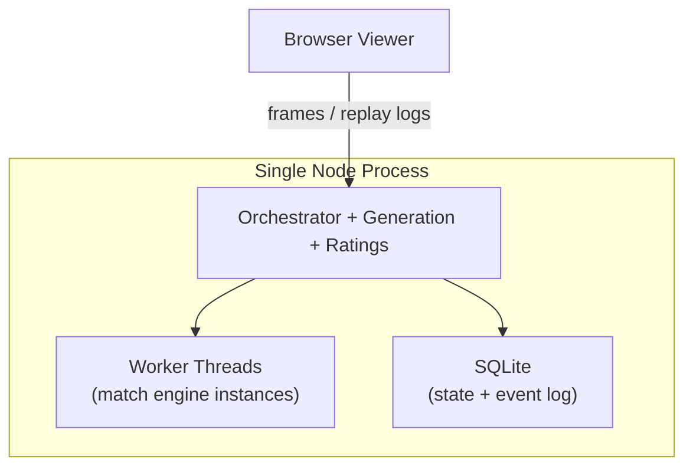

### 8.2 Topology B — scaled out

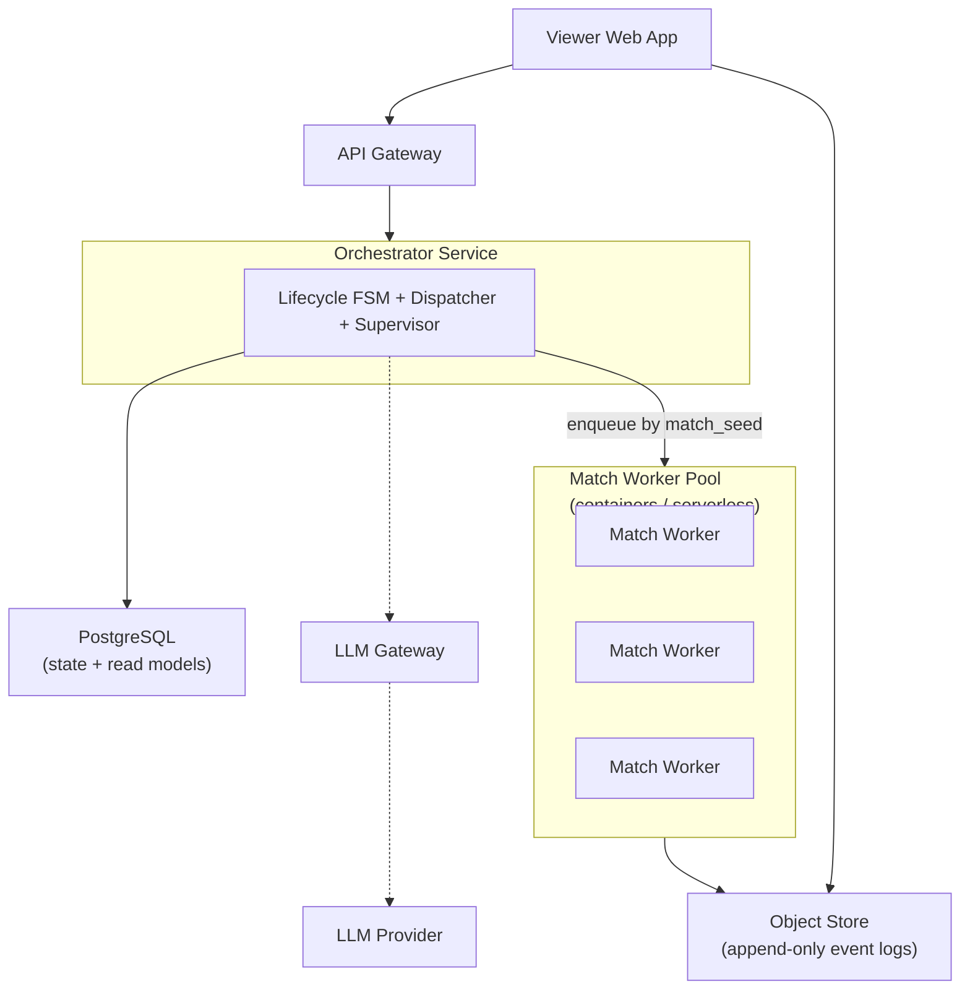

**Mapping rule:** matches are stateless given `(home, away, seed, rules)`, so workers need no sticky state — scale them horizontally; serialize only the writes to standings/bracket through the orchestrator.

---

## 9. Cross-Cutting Concepts

### 9.1 Determinism & the seed tree

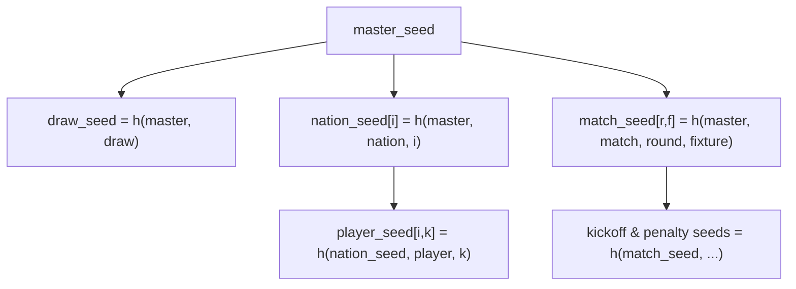

Every stochastic decision derives from a hashed path off the master seed. Two runs with the same `master_seed` + `config` produce an identical **run hash** (hash of the ordered event log).

### 9.2 Event sourcing & projections

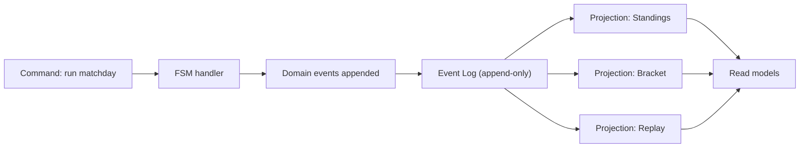

State is never mutated in place; it is a **fold over events**. This yields free replay (Q1), resume (Q4), and audit.

### 9.3 Run supervision & resumability

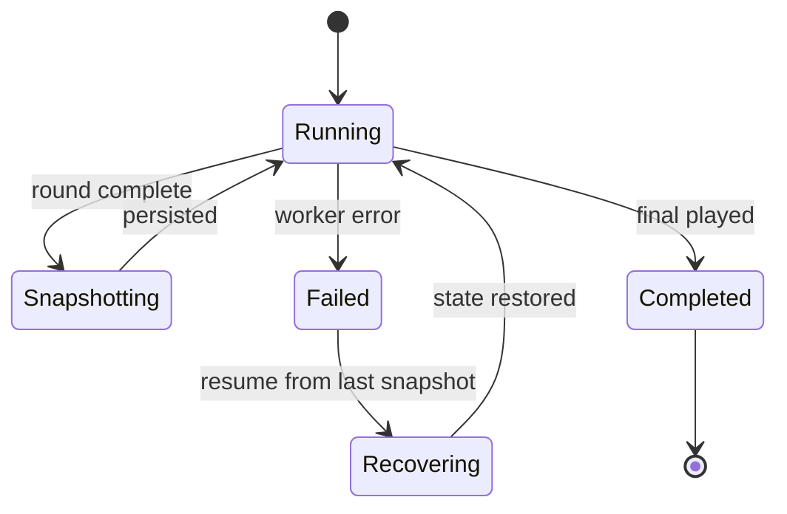

### 9.4 Team Orchestrator decision loop (hot path — no LLM)

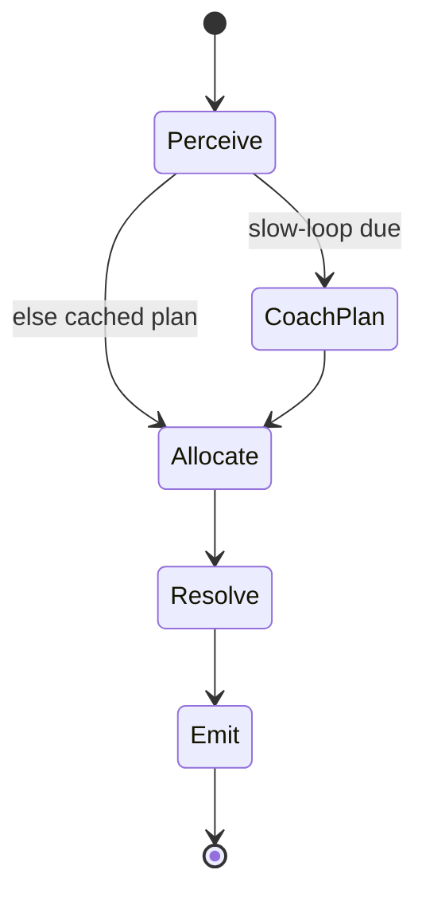

### 9.5 Observability

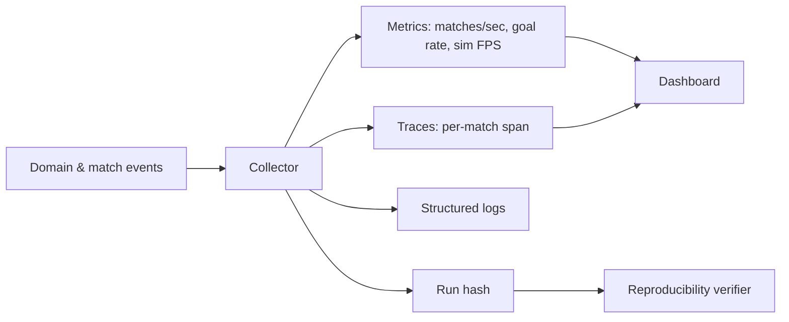

### 9.6 Other cross-cutting decisions
- **Concurrency model:** workers are pure functions of `(req)`; the orchestrator owns the only writer to shared state → no locks needed beyond a serialized write queue.
- **Error handling:** transient worker failures → idempotent re-run by seed; logic errors → fail the run, preserve the event log for diagnosis.
- **Configuration:** one `TournamentConfig` object validated up front; invalid configs never start a run.
- **Security:** the LLM Gateway is the only egress; prompts/outputs are logged and guardrailed; no external input reaches the deterministic core.
- **Extensibility:** new formats = new `TournamentPolicy` + config; new AI = new `DecisionPolicy`; both are injected, not edited in.

---

## 10. Architecture Decisions (ADRs)

| ID | Decision | Rationale | Trade-off accepted |
|---|---|---|---|
| ADR-001 | Deterministic seeded core | Reproducibility (Q1), testability, trust | Must rigorously exclude all uncontrolled randomness |
| ADR-002 | LLM strictly off the per-tick hot path | Latency + determinism | Per-tick AI limited to heuristic/RL |
| ADR-003 | Single Match Engine, dual entry (headless + render) | One source of truth for match logic | Build tooling must support both targets |
| ADR-004 | Event sourcing for match & tournament state | Free replay + resume + audit | Projection code + storage overhead |
| ADR-005 | Hierarchical FSM orchestration (not a flat agent swarm) | Predictable, debuggable tournament flow; encode tiebreakers explicitly | Less "emergent"; rules must be authored |
| ADR-006 | Strategy pattern for `DecisionPolicy` | Swap heuristic ↔ RL per team without core changes | Interface must stay stable |
| ADR-007 | Worker-pool parallelism keyed by `match_seed`; single writer | Throughput (Q2) with safe state | Round-level barrier before progression |
| ADR-008 | LLM Gateway with seed-keyed cache | Determinism even for "creative" outputs | Cache invalidation tied to seed/version |

---

## 11. Quality Requirements (scenarios)

```mermaid
flowchart TB
  q["Architecture Quality"] --> q1["Reproducibility"]
  q --> q2["Performance"]
  q --> q3["Modifiability"]
  q --> q4["Reliability"]
  q --> q5["Observability"]
  q1 --> q1a["Same seed -> same champion & run hash"]
  q2 --> q2a["64-match cup in low minutes headless"]
  q2 --> q2b["A match simulates faster than real time"]
  q3 --> q3a["Add a new format via config + policy only"]
  q3 --> q3b["Swap decision policy heuristic to RL"]
  q4 --> q4a["Resume after worker crash, identical result"]
  q5 --> q5a["Per-run hash + per-match trace available"]
```

| Scenario | Stimulus | Expected response | Measure |
|---|---|---|---|
| Q1 | Re-run with same seed/config | Identical event log | run hash matches |
| Q2 | Run a full 32-team cup headless | Completes quickly | < a few minutes on a laptop |
| Q3 | Add `world_cup_48` | No core edits | new config + policy file only |
| Q4 | Kill a worker mid-round | Round re-runs failed match | result identical, run continues |
| Q5 | Inspect a suspicious scoreline | Open its event log by seed | full deterministic replay |

---

## 12. Risks & Technical Debt

| Risk | Severity | Mitigation |
|---|---|---|
| Hidden non-determinism (unseeded RNG, unordered parallel writes, wall-clock) silently breaks Q1 | High | Funnel all randomness through Seed Provider; single writer; CI test asserts run-hash stability |
| Tiebreaker / drawn-knockout edge cases handled inconsistently | Medium | Encode in `TournamentPolicy`; exhaustive unit tests incl. three-way ties |
| "Agentic" framing over-engineers a problem a workflow engine could solve | Medium | Justify by needed extensibility (pluggable policies, narrative); keep the FSM the backbone |
| LLM cache drift (model/version change) alters "reproducible" flavor | Low | Key cache by `(seed, prompt, modelVersion)`; pin model version per run |
| Match Engine behavior diverges between headless and rendered builds | Medium | Shared core module; golden-master test comparing event logs across both entry points |
| Per-tick policy cost grows with richer AI | Low | Keep allocation O(11); heavy reasoning only in the cached slow loop |

---

## 13. Glossary

| Term | Meaning |
|---|---|
| Master seed | Single integer from which all randomness derives. |
| Sub-seed | Hashed derivation `h(master, ...path)` for a nation/match/player. |
| Run hash | Hash of the ordered event log; identity of a tournament run. |
| Blackboard | Shared, versioned state agents read/write. |
| Decision Policy | Pluggable strategy a Team Orchestrator uses to allocate roles and resolve actions. |
| Hot path | The per-tick simulation loop; must be deterministic and LLM-free. |
| Projection | A read model folded from the event log (standings, bracket, replay). |

---

## 14. Build Roadmap (incremental, each step shippable)

1. **Headless Match Engine** — `simulate(req) → result + events`; golden-master test vs the rendered build.
2. **Seed Provider + Generation Service** — deterministic nations/players/coaches/teams with tiers & style DNA.
3. **Event Log + projections** — standings/bracket/replay folded from events.
4. **Tournament Orchestrator FSM** — draw → group standings → bracket → knockouts → final.
5. **Ratings & tiebreakers** — Elo + full tiebreak chain with tests.
6. **Run Supervisor** — snapshot/resume; assert run-hash stability in CI.
7. **Worker-pool parallelism** — concurrent matches per round; single-writer progression.
8. **Viewer/replay integration** — watch live or replay any match by seed.
9. **LLM Gateway (optional)** — names, commentary, slow-loop hints; seed-keyed cache.
