# AI Agentic World Cup — Implementation Blueprint (React + TanStack · Python · Azure)

**Status:** Draft v1 · **Diagrams:** standard Mermaid (no `C4` syntax)

This document turns the architecture into a buildable blueprint:

1. Azure **solution architecture**
2. **Software architecture** (hexagonal / ports & adapters)
3. **Backend** (Python / FastAPI) — full file tree, module relationships, class diagrams, key skeletons
4. **Frontend** (React + TanStack) — full file tree, component hierarchy, data-flow, key skeletons
5. **All sequence diagrams** (end-to-end flows)

The deterministic **Match Engine** and the **one-AI-per-team Team Orchestrator** from the prior design are reused unchanged in intent; here they become Python packages.

---

## 1. Azure Solution Architecture

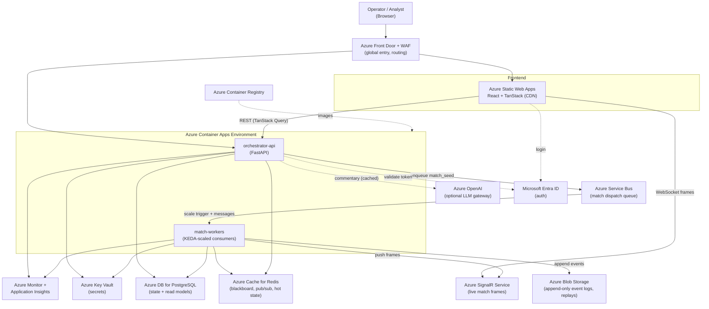

### 1.1 Service responsibility map

| Azure service | Role | Notes |
|---|---|---|
| **Static Web Apps** | Host the React + TanStack SPA | Global CDN, free SSL, GitHub Actions deploy |
| **Front Door + WAF** | Single global entry, route `/` → SWA, `/api` → API | TLS, WAF, caching |
| **Container Apps – orchestrator-api** | FastAPI: tournament lifecycle, queries, SignalR negotiate | Min 1 replica; HTTP ingress |
| **Container Apps – match-workers** | Consume queue, run Match Engine, emit events/frames | KEDA scale-to-zero on Service Bus depth |
| **Service Bus** | Match dispatch queue (one message per fixture) | Sessions/dedup by `match_seed` |
| **Cache for Redis** | Blackboard, pub/sub for live frames, hot tournament state | |
| **PostgreSQL Flexible Server** | Persisted state + read models (standings, bracket) | SQLAlchemy + Alembic |
| **Blob Storage** | Append-only event logs & replays | Immutable containers; cheap |
| **SignalR Service** | Push live match frames to browsers | Serverless mode behind FastAPI negotiate |
| **Azure OpenAI** | Optional names/commentary/slow-loop hints | Behind LLM Gateway, seed-keyed cache |
| **Key Vault / Managed Identity** | Secrets & connection strings | No secrets in env |
| **Container Registry** | Images for both Container Apps | |
| **Monitor + App Insights** | Metrics, traces, logs, run-hash verifier | |
| **Entra ID** | Operator auth | Optional for public demos |

---

## 2. Software Architecture (Hexagonal / Ports & Adapters)

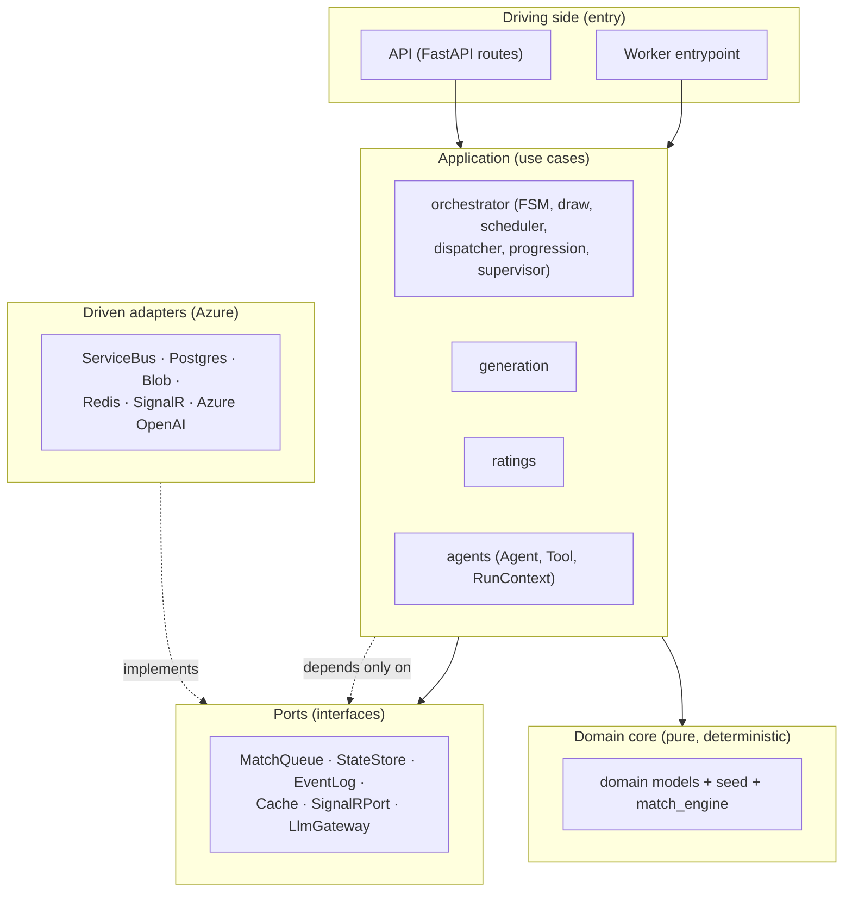

**Dependency rule:** arrows point inward. `domain` + `match_engine` depend on nothing external; `application` depends on `domain` and `ports`; Azure `adapters` implement `ports`. This keeps the deterministic core testable and swappable (e.g., Postgres → Cosmos with no domain change).

---

## 3. Backend — Python (FastAPI)

### 3.1 Full file tree

```text
backend/
├─ pyproject.toml                  # deps: fastapi, pydantic, sqlalchemy, alembic,
│                                  #   azure-servicebus, azure-storage-blob, redis,
│                                  #   azure-identity, openai, uvicorn, pytest
├─ Dockerfile                      # multi-stage; one image, two commands (api|worker)
├─ alembic.ini
├─ azure/
│  ├─ main.bicep                   # resource group composition
│  ├─ containerapps.bicep          # api + workers + env + KEDA rules
│  └─ data.bicep                   # postgres, redis, servicebus, blob, signalr
├─ src/
│  ├─ app/
│  │  ├─ main.py                   # FastAPI factory, router mount, middleware, lifespan
│  │  ├─ config.py                 # Settings (pydantic-settings), Azure bindings
│  │  ├─ deps.py                   # DI providers (ports → adapters via Settings)
│  │  └─ logging.py                # structured logging → App Insights
│  ├─ api/
│  │  ├─ routes_tournaments.py     # POST /tournaments, GET /{id}, /pause, /resume
│  │  ├─ routes_matches.py         # GET /matches/{id}, /events, /replay
│  │  ├─ routes_teams.py           # GET /teams/{id}, /players
│  │  ├─ routes_stream.py          # POST /negotiate (SignalR), WS fallback
│  │  └─ schemas.py                # API request/response DTOs (Pydantic)
│  ├─ domain/                      # PURE — no I/O, no Azure
│  │  ├─ ids.py                    # typed IDs
│  │  ├─ player.py                 # Player, Role
│  │  ├─ team.py                   # Team, CoachProfile, StyleDNA, Formation
│  │  ├─ tournament.py             # Tournament, Phase, Fixture, Standing, Config
│  │  ├─ match.py                  # MatchRequest, MatchRules, MatchResult, MatchEvent
│  │  └─ events.py                 # DomainEvent taxonomy
│  ├─ seed/
│  │  ├─ provider.py               # sub_seed(master, *path) — stable hashing
│  │  └─ rng.py                    # SeededRng (LCG) — parity with JS engine
│  ├─ generation/
│  │  ├─ national_team_generator.py
│  │  ├─ identity.py               # tier + styleDNA
│  │  ├─ player_generator.py
│  │  ├─ coach_generator.py
│  │  └─ team_builder.py           # XI, validation, rating
│  ├─ match_engine/               # the reused simulation (deterministic)
│  │  ├─ engine.py                 # MatchEngine.simulate(req) → MatchResult
│  │  ├─ runtime.py                # fixed-timestep accumulator loop
│  │  ├─ physics.py                # kinematics, collisions, ball
│  │  ├─ world.py                  # MatchWorldState
│  │  ├─ team_orchestrator.py      # coach (slow) + orchestrate (fast)
│  │  ├─ behaviors.py              # role → action (pass/shoot/dribble/clear)
│  │  ├─ recorder.py               # MatchEvent recorder + frame sink
│  │  └─ policies/
│  │     ├─ base.py                # DecisionPolicy (interface)
│  │     ├─ heuristic.py           # HeuristicPolicy (default)
│  │     └─ rl.py                  # RLPolicy (pluggable stub)
│  ├─ orchestrator/
│  │  ├─ fsm.py                    # TournamentOrchestrator lifecycle FSM
│  │  ├─ draw.py                   # DrawAgent
│  │  ├─ scheduler.py              # SchedulerAgent
│  │  ├─ dispatcher.py             # MatchDispatcher → MatchQueue port
│  │  ├─ progression.py            # qualifiers, bracket build, advancement
│  │  ├─ aggregator.py             # ResultAggregator (+ optional commentary)
│  │  ├─ policy.py                 # TournamentPolicy (format, tiebreakers, ET/pens)
│  │  ├─ supervisor.py             # RunSupervisor (snapshot/resume)
│  │  └─ blackboard.py             # Blackboard (Cache port)
│  ├─ ratings/
│  │  ├─ elo.py                    # rating update
│  │  ├─ standings.py              # table calc + tiebreaker chain
│  │  └─ winprob.py
│  ├─ agents/
│  │  ├─ base.py                   # Agent, Tool, RunContext (Protocols)
│  │  └─ registry.py               # AgentRegistry, ToolRegistry
│  ├─ workers/
│  │  ├─ match_worker.py           # consume queue → simulate → events/frames
│  │  └─ main.py                   # worker process entrypoint
│  ├─ infra/                       # DRIVEN ADAPTERS (Azure)
│  │  ├─ ports.py                  # Protocols: MatchQueue, StateStore, EventLog,
│  │  │                            #   Cache, SignalRPort, LlmGateway
│  │  ├─ queue_servicebus.py
│  │  ├─ store_postgres.py         # SQLAlchemy models + repositories
│  │  ├─ eventlog_blob.py
│  │  ├─ cache_redis.py
│  │  ├─ signalr.py
│  │  └─ llm_gateway.py            # Azure OpenAI + seed-keyed cache
│  └─ observability/
│     ├─ metrics.py
│     ├─ tracing.py
│     └─ run_hash.py               # hash of ordered event log
└─ tests/
   ├─ test_determinism.py          # same seed → same run hash
   ├─ test_tiebreakers.py          # incl. three-way ties
   ├─ test_match_engine_golden.py  # golden-master event log
   └─ test_generation.py
```

### 3.2 Module dependency graph (allowed directions)

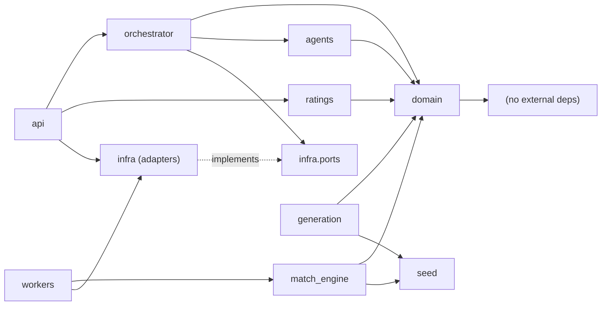

### 3.3 Class diagram — Domain model

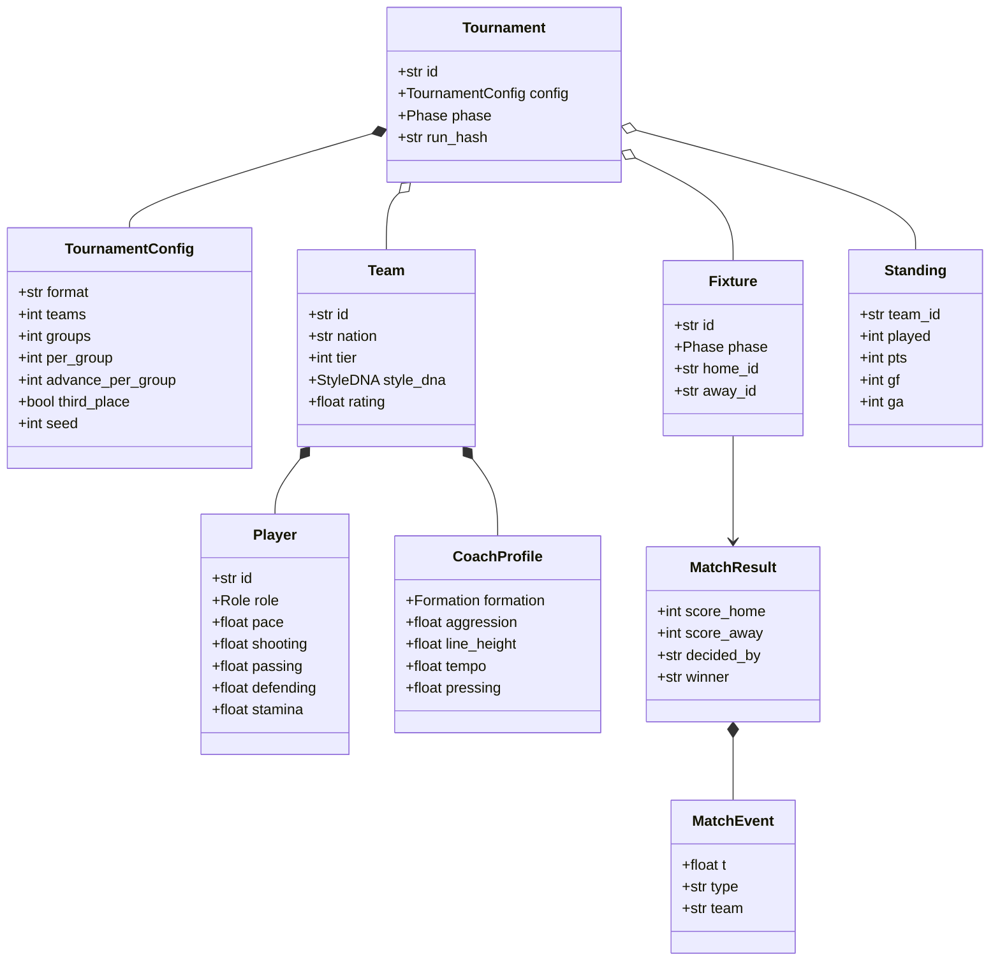

### 3.4 Class diagram — Match Engine & decision policies

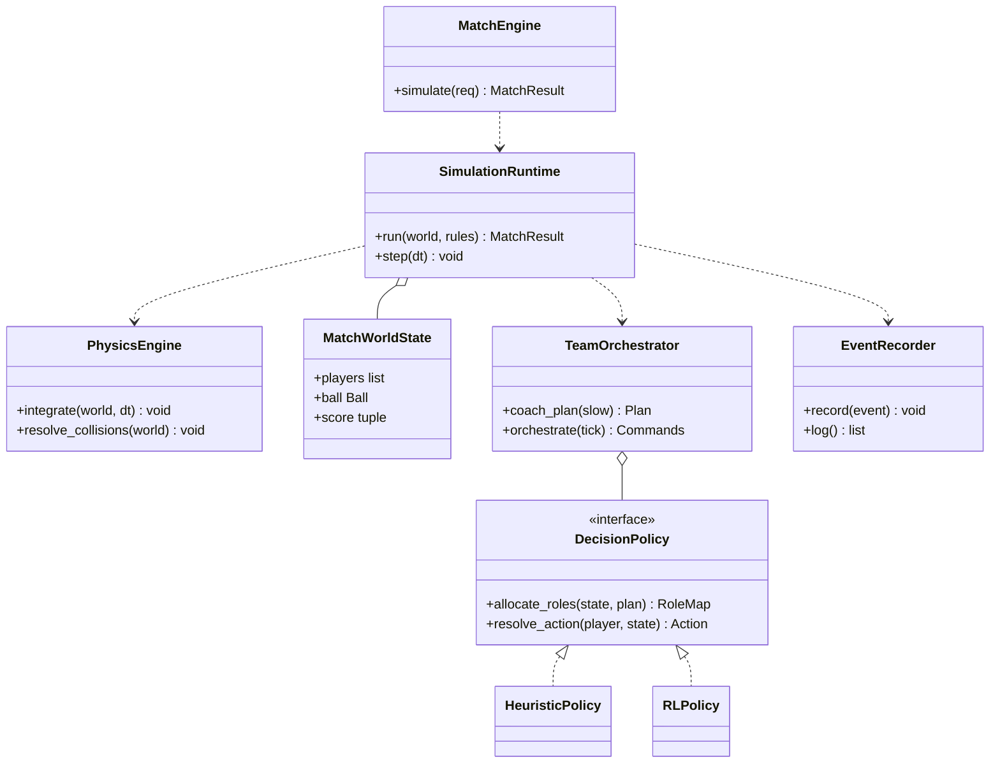

### 3.5 Class diagram — Orchestrator & agent framework

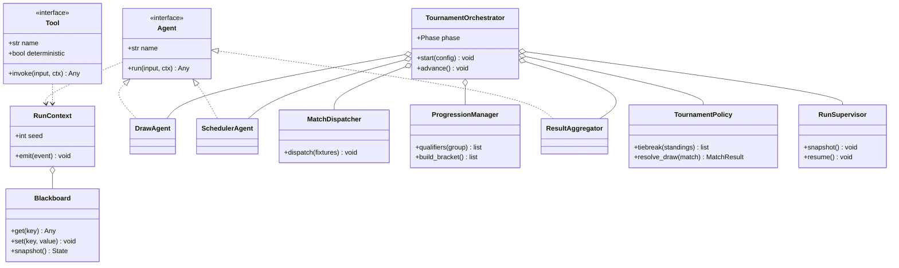

### 3.6 Class diagram — Ports & Azure adapters

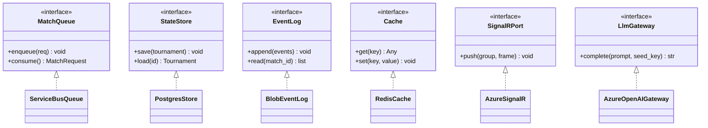

### 3.7 Representative skeletons

```python
# src/agents/base.py
from typing import Protocol, Any, runtime_checkable

@runtime_checkable
class RunContext(Protocol):
    seed: int
    def emit(self, event: "DomainEvent") -> None: ...

class Tool(Protocol):
    name: str
    deterministic: bool
    def invoke(self, input: Any, ctx: RunContext) -> Any: ...

class Agent(Protocol):
    name: str
    async def run(self, input: Any, ctx: RunContext) -> Any: ...
```

```python
# src/match_engine/policies/base.py
from typing import Protocol
from src.domain.match import Action
from src.match_engine.world import MatchWorldState

class DecisionPolicy(Protocol):
    def allocate_roles(self, state: MatchWorldState, plan: "Plan") -> "RoleMap": ...
    def resolve_action(self, player_id: str, state: MatchWorldState) -> Action: ...
```

```python
# src/match_engine/engine.py
from src.domain.match import MatchRequest, MatchResult
from src.match_engine.runtime import SimulationRuntime

class MatchEngine:
    def __init__(self, runtime: SimulationRuntime) -> None:
        self._runtime = runtime

    def simulate(self, req: MatchRequest) -> MatchResult:
        # pure function of (home, away, seed, rules) — fully deterministic
        return self._runtime.run(req)
```

```python
# src/orchestrator/fsm.py  (abridged)
from src.domain.tournament import Phase, TournamentConfig
from src.infra.ports import MatchQueue, StateStore, EventLog

class TournamentOrchestrator:
    def __init__(self, queue: MatchQueue, store: StateStore, log: EventLog, deps): ...

    async def start(self, config: TournamentConfig) -> None:
        self.phase = Phase.GENERATING
        await self._generate_teams(config)
        self.phase = Phase.DRAW
        await self._draw_groups()
        await self._run_group_stage()      # dispatch matchdays in parallel
        await self._run_knockouts()        # r16 → qf → sf → final (ET/pens)
        self.phase = Phase.DONE
```

```python
# src/workers/match_worker.py  (abridged)
async def handle(message, engine, log: EventLog, signalr):
    req = MatchRequest.parse_raw(message.body)
    result = engine.simulate(req)                 # deterministic
    await log.append(result.events)               # Blob append-only
    await signalr.push(req.match_id, result.frames_summary)
    return result
```

```python
# src/app/deps.py  (ports → Azure adapters, chosen by Settings)
def build_queue(settings) -> MatchQueue:
    return ServiceBusQueue(settings.servicebus_conn)
def build_store(settings) -> StateStore:
    return PostgresStore(settings.pg_dsn)
def build_eventlog(settings) -> EventLog:
    return BlobEventLog(settings.blob_conn)
```

---

## 4. Frontend — React + TanStack

Stack: **Vite + React + TypeScript**, **TanStack Query** (server state), **TanStack Router** (routing), **TanStack Table** (standings/squad), **@microsoft/signalr** (live frames), Canvas2D viewer.

### 4.1 Full file tree

```text
frontend/
├─ package.json                   # react, @tanstack/react-query, @tanstack/react-router,
│                                  #   @tanstack/react-table, @microsoft/signalr, vite
├─ vite.config.ts
├─ tsconfig.json
├─ index.html
├─ staticwebapp.config.json       # Azure Static Web Apps routing/auth
└─ src/
   ├─ main.tsx                     # bootstrap: QueryClientProvider + RouterProvider
   ├─ app/
   │  ├─ providers.tsx             # Query + Router + SignalR + Theme providers
   │  └─ queryClient.ts            # TanStack Query client (staleTime, retry)
   ├─ router.tsx                   # route tree assembly
   ├─ routes/                      # TanStack Router routes
   │  ├─ __root.tsx                # AppShell + nav
   │  ├─ index.tsx                 # Dashboard: create/start tournament
   │  ├─ tournaments.$id.tsx       # overview (phase stepper, summary)
   │  ├─ tournaments.$id.groups.tsx
   │  ├─ tournaments.$id.bracket.tsx
   │  ├─ matches.$id.tsx           # live match
   │  ├─ matches.$id.replay.tsx    # replay
   │  └─ teams.$id.tsx             # squad + coach
   ├─ api/
   │  ├─ client.ts                 # fetch wrapper (baseURL, auth header)
   │  ├─ tournaments.ts            # createTournament, getStatus, pause, resume
   │  ├─ matches.ts                # getMatch, getEvents
   │  ├─ teams.ts                  # getTeam
   │  └─ types.ts                  # API types mirroring backend Pydantic DTOs
   ├─ hooks/                       # TanStack Query hooks
   │  ├─ useCreateTournament.ts    # useMutation
   │  ├─ useTournament.ts          # useQuery (polled while running)
   │  ├─ useStandings.ts
   │  ├─ useBracket.ts
   │  ├─ useMatch.ts
   │  ├─ useMatchEvents.ts         # replay source
   │  └─ useLiveMatch.ts           # SignalR subscription → frame buffer
   ├─ stores/
   │  ├─ uiStore.ts                # selected entities, theme (TanStack Store/Zustand)
   │  └─ simStore.ts               # live frame ring buffer
   ├─ components/
   │  ├─ layout/{AppShell,NavBar}.tsx
   │  ├─ tournament/
   │  │  ├─ PhaseStepper.tsx
   │  │  ├─ GroupTable.tsx         # TanStack Table
   │  │  ├─ BracketView.tsx
   │  │  └─ FixtureList.tsx
   │  ├─ match/
   │  │  ├─ PitchCanvas.tsx        # Canvas2D renderer (live + replay)
   │  │  ├─ MatchScoreboard.tsx
   │  │  ├─ MatchTimeline.tsx
   │  │  └─ ReplayControls.tsx
   │  ├─ team/{SquadTable,CoachCard,PlayerRadar}.tsx
   │  └─ common/{DataTable,Loading,ErrorState}.tsx
   ├─ canvas/
   │  ├─ renderer.ts               # draw pitch/players/ball from a Frame
   │  ├─ interpolate.ts            # smooth between frames
   │  └─ types.ts                  # Frame, RenderState
   ├─ realtime/
   │  └─ signalr.ts                # connection lifecycle, negotiate via API
   ├─ lib/{format.ts,seed.ts}
   └─ styles/theme.css
```

### 4.2 Component hierarchy

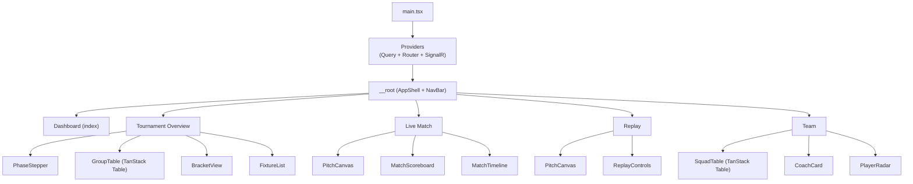

### 4.3 Frontend data flow (TanStack Query + SignalR)

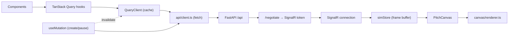

### 4.4 Representative skeletons

```tsx
// src/app/queryClient.ts
import { QueryClient } from "@tanstack/react-query";
export const queryClient = new QueryClient({
  defaultOptions: { queries: { staleTime: 5_000, retry: 2 } },
});
```

```tsx
// src/hooks/useTournament.ts
import { useQuery } from "@tanstack/react-query";
import { getStatus } from "../api/tournaments";
export function useTournament(id: string) {
  return useQuery({
    queryKey: ["tournament", id],
    queryFn: () => getStatus(id),
    refetchInterval: (q) => (q.state.data?.phase === "done" ? false : 2000),
  });
}
```

```tsx
// src/hooks/useLiveMatch.ts
import { useEffect } from "react";
import { connectMatch } from "../realtime/signalr";
import { useSimStore } from "../stores/simStore";
export function useLiveMatch(matchId: string) {
  const push = useSimStore((s) => s.pushFrame);
  useEffect(() => {
    const conn = connectMatch(matchId, push);
    return () => { conn.stop(); };
  }, [matchId, push]);
}
```

```tsx
// src/components/match/PitchCanvas.tsx  (abridged)
import { useRef, useEffect } from "react";
import { drawFrame } from "../../canvas/renderer";
import { useSimStore } from "../../stores/simStore";
export function PitchCanvas() {
  const ref = useRef<HTMLCanvasElement>(null);
  const frames = useSimStore((s) => s.frames);
  useEffect(() => {
    const ctx = ref.current!.getContext("2d")!;
    let raf = requestAnimationFrame(function loop() {
      drawFrame(ctx, frames.current());     // interpolated frame
      raf = requestAnimationFrame(loop);
    });
    return () => cancelAnimationFrame(raf);
  }, [frames]);
  return <canvas ref={ref} className="pitch" />;
}
```

```ts
// src/api/client.ts
const BASE = import.meta.env.VITE_API_BASE ?? "/api";
export async function http<T>(path: string, init?: RequestInit): Promise<T> {
  const res = await fetch(`${BASE}${path}`, {
    headers: { "Content-Type": "application/json" }, ...init,
  });
  if (!res.ok) throw new Error(`${res.status} ${res.statusText}`);
  return res.json() as Promise<T>;
}
```

---

## 5. Sequence Diagrams (all flows)

### 5.1 Create & start a tournament

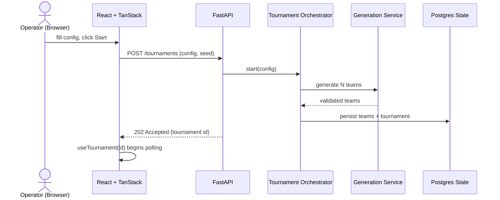

### 5.2 Team generation (deterministic)

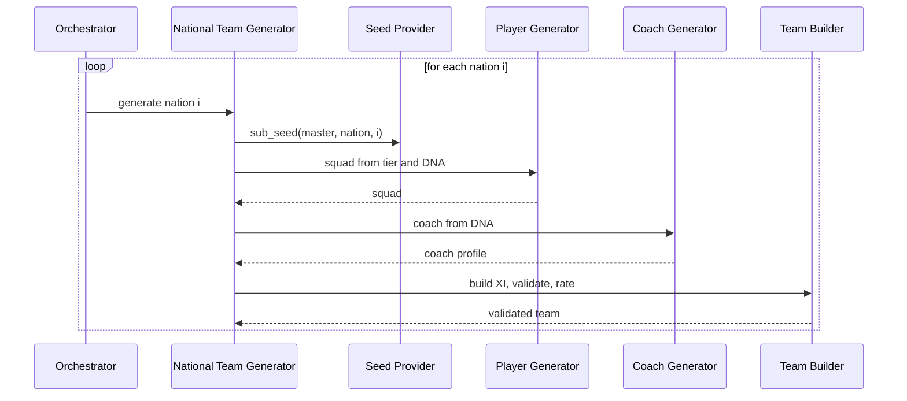

### 5.3 Group matchday (parallel via Service Bus + workers)

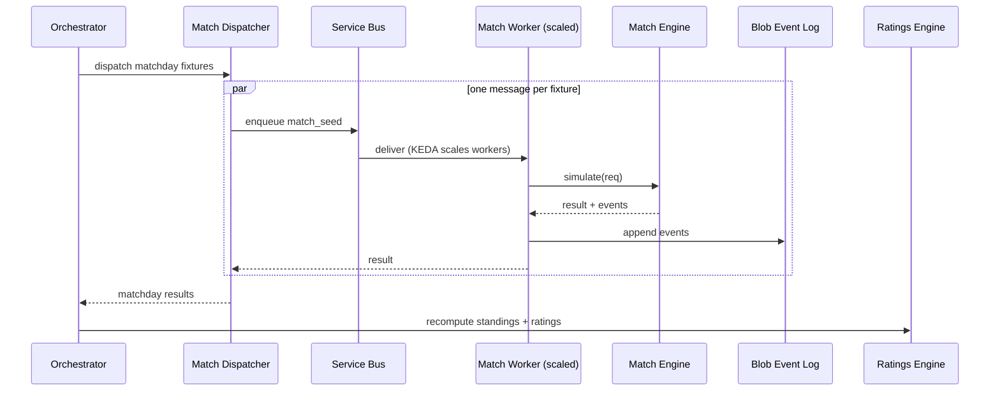

### 5.4 Single match simulation (inside a worker)

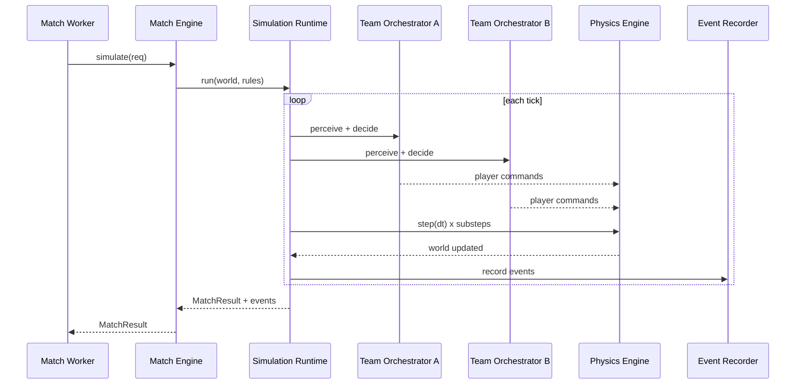

### 5.5 Live match viewing (SignalR)

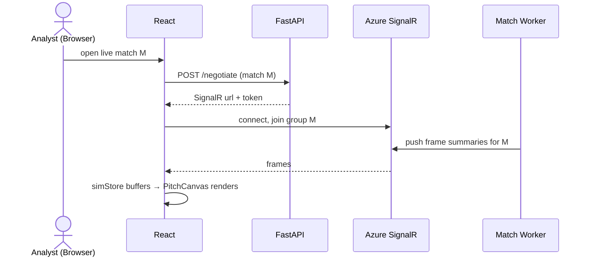

### 5.6 Replay from event log

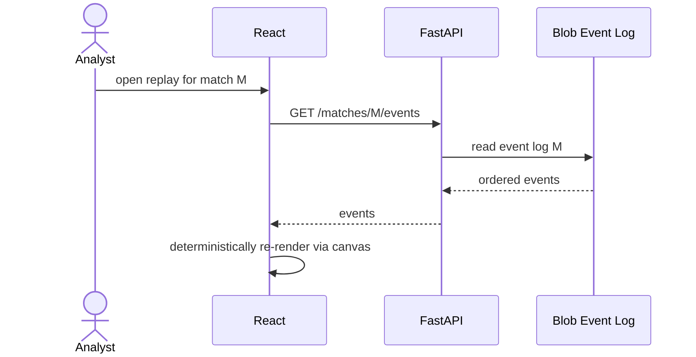

### 5.7 Knockout resolution (ET / penalties)

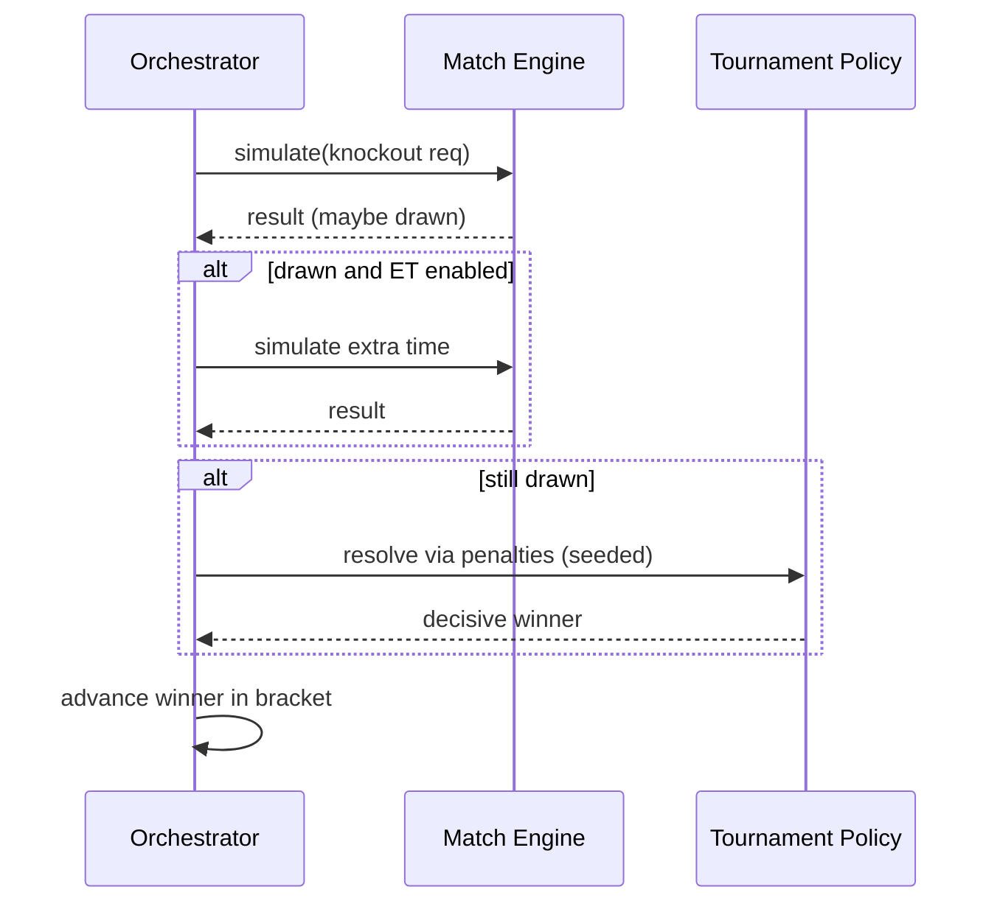

### 5.8 Pause & resume (Run Supervisor)

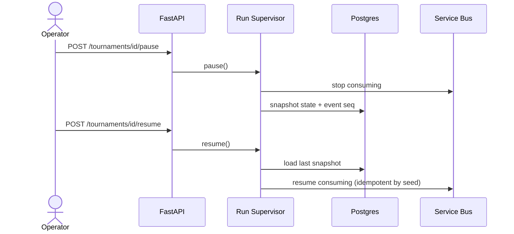

### 5.9 Standings / bracket query (read model)

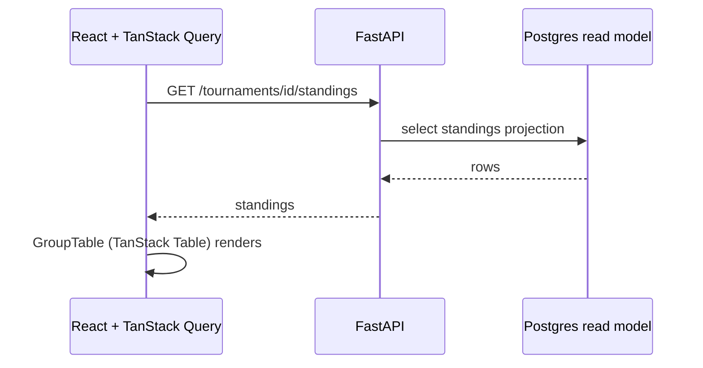

### 5.10 Optional LLM commentary (cached)

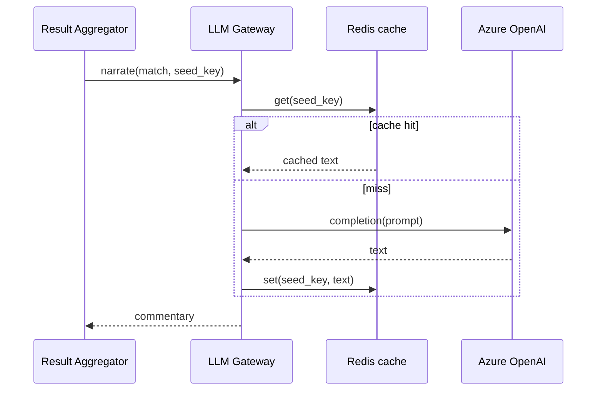

---

## 6. Build & Deploy Notes

- **One backend image, two commands.** `uvicorn src.app.main:app` for the API; `python -m src.workers.main` for workers. Same image → same Match Engine code on both paths (golden-master tested).
- **Frontend** builds to static assets → Azure Static Web Apps; `VITE_API_BASE` points at Front Door `/api`.
- **Infra as code** in `azure/*.bicep`; secrets via Key Vault + Managed Identity (no connection strings in env).
- **CI gates:** `test_determinism` asserts run-hash stability; `test_match_engine_golden` compares worker output to the recorded baseline; both must pass before deploy.
- **Scaling:** workers scale-to-zero and scale-out on Service Bus depth (KEDA); the API stays at ≥1 replica for SignalR negotiate and queries.
